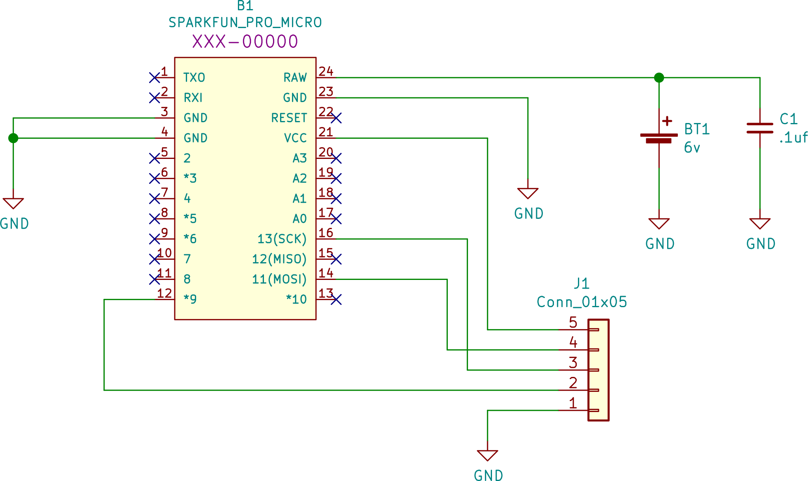
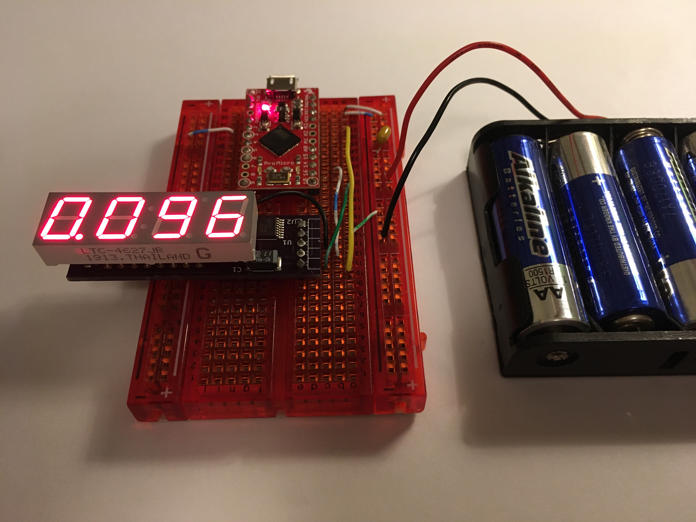

This topic demonstrates how to control the display device with a microcontroller.
We use a Sparkfun Pro Micro as the microcontroller.
Almost any microcontroller supported by the Arduino ecosystem can be used.
The circuit is as follows:

The J1 connector represents our 4-digit display connector.
If a different Arduino device is used, the constraints are simply:

- The serial peripheral interface (SPI) signals SCK and MOSI must be connected to J1 pins as shown.
- Any GPIO pin can be selected for the device latch signal; pin #2 on J1

On a breadboard, the demonstration circuit looks like this:

The Arduino code for the demonstration is [here](./).
It is organized as an Arduino module named 'count'.
Open the 'count' directory in the Arduino IDE to work with this demonstration.
When compiled and loaded into the microcontroller, you should see the display slowly count from '0.090' to '0.101',
then blank for one second, then repeat.

Review the code comments for complete details.
