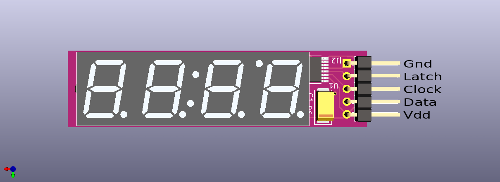
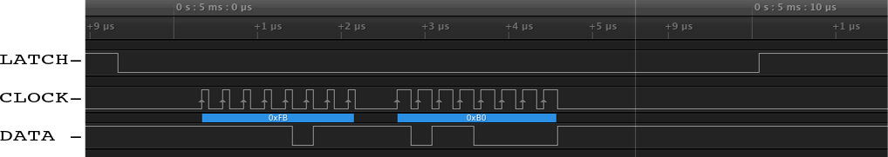
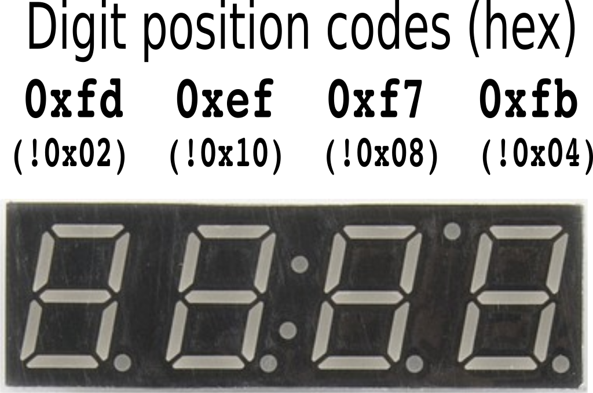

- [Overview](#overview)
- [References](#references)

### Overview

The 4 digit backpack provides quick and easy control of four 7-segment digits and decimal points,
via a serial protocol interface.  The colon and degree LED dots are not connected in this design.

The device will operate with a power supply (Vdd) range of 3 to 5.5 volts.
The ICs used are rated for an absolute maximum of 6 volts for Vdd.

To communicate a display item to the device, two sequential bytes of data are transferred,
using the Latch, Clock, and Data signals in an SPI protocol transfer.  Here is an example:

The latch signal must be low during the serial shift, and raised after the serial shift is complete,
to transfer the new data to the display driver.  

- The first byte specifies which digits should be selected for illumination.
  It is interpreted as a bit-mask, so multiple digits could be selected at the same time.
- The second byte is also a bit-mask; it specifies which segments should be illuminated,
  in all the digits that are currently selected.

Note this important constraint; this device cannot display different segments in different digits at the same instant in time.
To display an arbitrary 4-digit number, a strobe technique must be used: very rapidly, one digit is illuminated at a time.
This is covered in more detail in the demonstration.

The following diagrams illustrate the exact byte values necessary for the respective digit and segment control.

  

See [the demonstration topic](../demo-pro-micro/guide.md) for a complete example.

### References
- [Part schematic](schematic.svg)
- [Datasheet for LED device](https://www.mouser.com/datasheet/2/239/LTC-4627JR-1144006.pdf)
