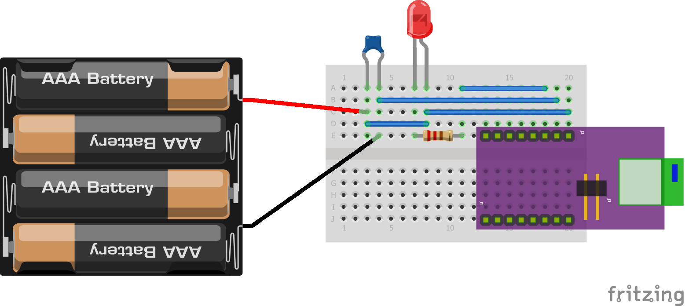

This demonstration details a 'remote LED' system.  An LED is attached to the BLE breakout device.  
The LED can be turned on an off remotely, using a mobile phone application.

- [Configure the RN4871](#configure-the-rn4871)
    + [Define a simple private service](#define-a-simple-private-service)
    + [Define a 2 line script](#define-a-2-line-script)
    + [Enable the script](#enable-the-script)
- [Assemble the circuit](#assemble-the-circuit)
- [Run the control application](#run-the-control-application)

### Configure the RN4871

Connect to the RN4871 and enter the command mode as described in the [console guide](../demo-console/guide.md).  
Clean up any previous scripting and/or configuration using the following commands.

    CMD> pz
    AOK
    CMD> wc
    AOK
    CMD> r,1
    Rebooting
    %REBOOT%

As shown, this results in a reboot, so it will again be necessary to enter the command mode.

#### Define a simple private service

Enter these commands:

    CMD> PS,59c88760536411e7b114b2f933d5fe66
    AOK
    CMD> PC,59c889e0536411e7b114b2f933d5fe66,08,01
    AOK
    CMD> ls
    59C88760536411E7B114B2F933D5FE66
      59C889E0536411E7B114B2F933D5FE66,0072,08
    END
    CMD>

For both the 'PS' and 'PC' commands, the first argument following the comma is a 16-byte number known as a universal GUID.
A different GUID is used for each command.   For experimenting, it is fine to use the GUIDs given here. 
The 'ls' command confirms the service has been created, and gives us a numeric code that we need for the next step.  
In this case, it is '0072'.

#### Define a 2 line script

This script will use the received service data to set a GPIO pin state.  
The service code in the script prefixed with '%' is from the 'ls' output above.

    CMD> ww
    @CONN
    |O,08,%0072
    AOK
    CMD>

The 'WW' command is used to switch to 'script entry' mode.  
The 'WW' command line, and each of the two script lines, are completed with a carriage-return ('enter' key) as usual.  
However, after entering both script lines, it is also necessary to press the escape ('Esc') key to exit the 'script entry' mode.

#### Enable the script

Make sure the script will run by default:

    CMD> sr,0040
    AOK
    CMD>

The RN4871 is now programmed.  It will retain this program even when powered down.  
For more information on all the commands and scripting capabilities of the RN4871, refer to the 
_Bluetooth Low Energy Module User's Guide_.  
This document can be found under the _Documents_ tab of the 
[Microchip RN4871 home page](https://www.microchip.com/wwwproducts/en/RN4871).

### Assemble the circuit

Assemble the remote LED system as shown below.  The capacitor should be non-polarized and approximately 1uf.  
The resistor is 220 ohms. For the diode, the anode is on the right.  You should connect the power (the red wire) last.

When you connect the power, a blue LED on the left side of the RN4871-BB board should begin to flash, 
approximately once every three seconds.

### Run the control application

We can use _nRF Connect for Mobile_ to control the device.  
This diagnostic application is available for iPhones and Android phones.  
Check the app-store links on the 
[Nordic Semiconductor page](https://www.nordicsemi.com/Software-and-Tools/Development-Tools/nRF-Connect-for-mobile), 
or search for the name in the app-store on your phone.

Run the application and navigate as described below.
(Note: there is an older version of the application with a significantly different layout.  
The navigation for this older version is here.)

#### 1. Locate your device in the scan list and press connect.

#### 2. Tap the right side of the tab-bar to reach the Services tab.

#### 3. Swipe upwards to scroll to the bottom of the Attribute Table.

#### 4. Select the characteristic.
At the bottom of the attribute table you should see the 
GUID for the characteristic we created on our BLE device (highlighted here in yellow).  
Tap the circled-arrow to interact with this characteristic.

   

#### 5.  Control the LED 
To turn the LED off, select data type Uint8 and enter one digit; 8.  
Then press Write.

     

To turn the LED on, select data type Uint8 and enter one digit; 0.  
Then press Write.

     
