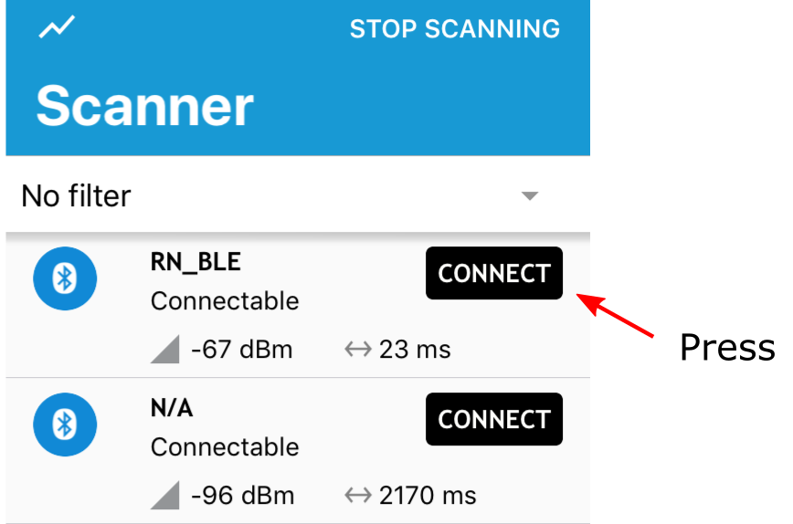
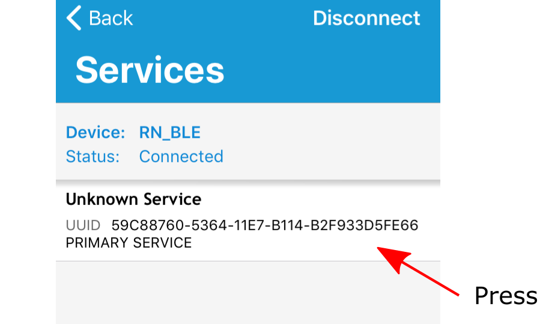
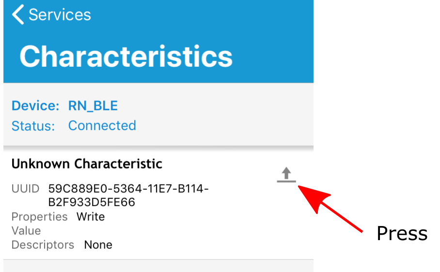
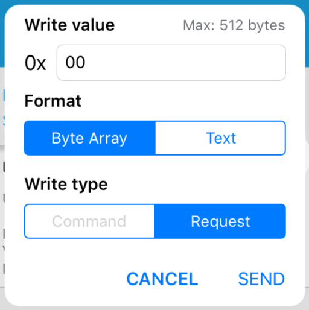
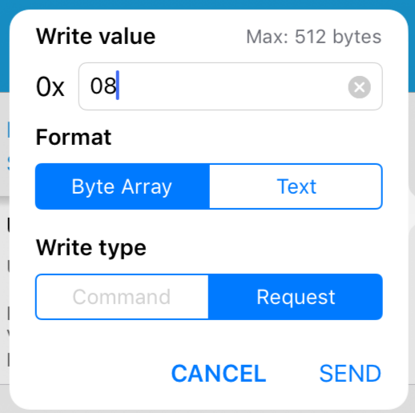

### Run the control application (old version)

We can use nRF Connect for Mobile to control the device.  This page describes the usage for an older version of the app.
If you have updated your app, or have not yet installed it, use the [current instructions](../guide.md).

Run the application and use the scan/connect function to establish a Bluetooth connection to the RN4871-BB.
You will see that the device advertises one service, with one characteristic.

- To turn the LED on send one hex byte byte, value '00', to the characteristic.
- To turn the LED off send one hex byte, value '08' to the characteristic.

_It is important to always describe the byte with two digits, and to use the 'hex' write option (not the text/ascii option)._

These steps are described with application screen-shots below.

### Screenshots of nRF Connect for Mobile

#### 1. Scan and connect

#### 2. Access service

#### 3. Access function

#### Turn LED on

#### Turn LED off

