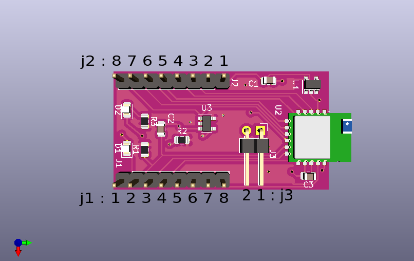

- [Overview](#overview)
- [Pinouts](#pinouts)
- [References](#references)

### Overview 

The BLE breakout board serves primarily to expose all the connections of the RN4871 module in a form-factor that is easier for use on a breadboard or other prototype environment.

Four additional features are included:

* A 3.3 volt regulator is included.  The RN4871 module operates at 3.3 volts; this regulator makes it easier to incorporate the RN4871 in a system with a higher supply voltage.
* A jumper is included to put the device into flash-program mode.
* A blue LED is connected to the RN4871 'mode' signal (LED0).  This LED flashes slowly when disconnected.  It flashes faster when connected.
* An orange LED is attached to the RN4871 'tx' signal.  Flashes whenever data is emitted on the module serial line, which is typically when the device is in 'transparent UART' mode and is receiving data over the air.

Two demonstration topics are available to assist in developing with this device:

* [A guide for accessing the console of the device](../demo-console/guide.md)
* [A demonstration of remote-control of a digital signal](../demo-remote-light/guide.md)

### Pinouts
#### J1 
| Pin | Description |
|-----|-------------|
| 1 | RN4871 P3_6 : GPIO; default: Input; pulled-high
| 2 | RN4871 RST : module reset
| 3 | RN4871 P0_0 : GPIO; default: Input; pulled-high
| 4 | RN4871 P0_2 : AD2LED0: Provides indication whether the module is in ON/OFF mode
| 5 | GND
| 6 | RN4871 VBAT : Positive regulated supply input. Range: 1.9V~3.6V
| 7 | RN4871 P2_7 : UART_TX_IND output pin
| 8 | RN4871 P2_0 : System configuration input; 1=Application mode (default), 0=Flash update

#### J2 
| Pin | Description |
|-----|-------------|
| 1 | 5 volt power supply. Range 4.8v ~ 6
| 2 | GND
| 3 | RN4871 P1_2 : GPIO; default: Input; pulled-high / AD10; I2C SCL pin
| 4 | RN4871 P1_3 : GPIO; default: Input; pulled-high / AD11; I2C SDA pin
| 5 | RN4871 P1_7 : Configurable pin. Refer to vendor specification
| 6 | RN4871 P1_6 : Configurable pin. Refer to vendor specification
| 7 | RN4871 UART_RX
| 8 | RN4871 UART_TX

#### J3
| Pin | Description |
|-----|-------------|
| 1 | GND
| 2 | RN4871 System configuration input P0_2. Leave disconnected for normal operation. Jumper to ground to re-flash EEPROM.

### References
- [Schematic](schematic.svg)
- [Vendor home page for RN4871](https://www.microchip.com/wwwproducts/en/RN4871)
