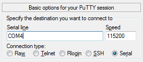

This topic describes the software setup necessary to access the console of the BLE serial USB board.
This is a necessary preparation step for the [BLE serial USB demo](../demo-pipe/guide.md).

- [Terminal emulation](#terminal-emulation)
- [Command mode](#command-mode)

### Terminal emulation

This example uses the 'Putty' terminal emulator to access the RN4871 console.
You can get Putty [here](https://www.chiark.greenend.org.uk/~sgtatham/putty/latest.html).
It is available for many operating systems.
The default serial connection settings for the RN4871 UART are the same as the Putty defaults, with one exception; the speed.
The default speed for the RN4871 is 115200 baud.

So, for example, if your BLE serial USB device has been assigned port 4 on a Windows system,
the Putty dialog to initiate a terminal should look like this:

This setting, found in the 'Terminal' section of the Putty configuration, is also helpful for uncluttered console output:

### Command mode

Once you've physically connected the device and started the terminal emulator,  you can switch the device to command mode.  This is done by typing three dollar-sign characters in the terminal emulator application.  You will not see the characters in the terminal window, but the result should be a command prompt returned by the RN4871:

CMD>

The command mode is a good way to verify that the device is properly attached to the system.  One basic command available is 'd' (display basic configuration).  Try pressing the 'd' key followed by 'enter' key.  You should see something like this as a result:

CMD> d

BTA=D88039F80080

Name=RN_BLE

Connected=no

Authen=2

Features=0000

Services=00

CMD>

If you did not see the 'd' in the terminal when you typed it, you might also prefer to turn on 'echo'.  Do this by pressing the '+' key followed by the 'enter' key.  The device should respond like this:

CMD> ECHO ON

CMD>

Subsequent commands should be visible as you type them.

Refer to the device user's guide for other useful commands.  Before executing the demo, you should exit from the command mode.  To exit the command mode, press the dash ('-') key three times, followed by the 'enter' key.  You should see this indication in the terminal window:

CMD> END
