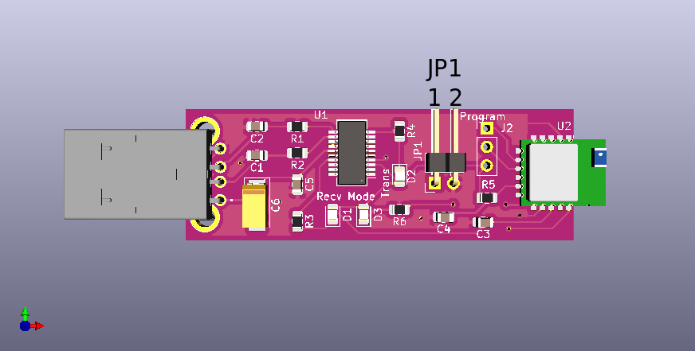

- [Overview](#overview)
- [Pinouts](#pinouts)
- [References](#references)

### Overview 

The BLE serial USB board makes the RN4871 module accessible from any PC or laptop.
Four additional hardware features are included:

1. A jumper is included to put the device into flash-program mode.
2. A blue LED is connected to the RN4871 'mode' signal (LED0).
   This LED flashes slowly when disconnected, and flashes faster when connected.
3. A red LED is connected to the RN4871 'tx' signal.
   It flashes whenever data is emitted on the module serial line, which is typically
   when the device is in 'transparent UART' mode and is receiving data over the air.
4. A green LED is connected to the RN4871 'rx' signal.
   It flashes whenever data is passed to the module on the serial line.

Two topics are available in the library to assist in developing with this device:

    A guide for accessing the console of the device: BLE serial USB console
    A demonstration of communication between the device and a mobile phone application: BLE serial USB demo

References

Part schematic

Vendor home page for RN4871
